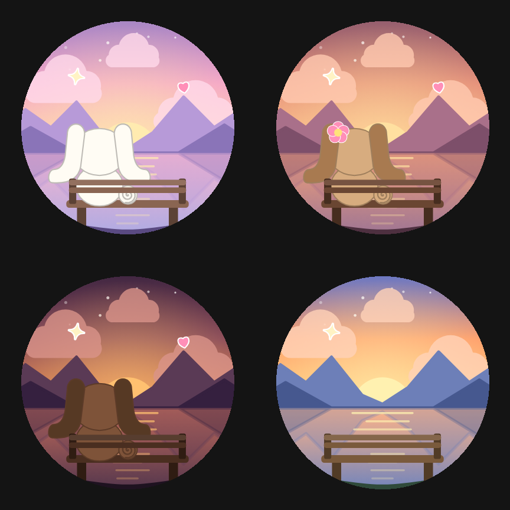

# Better Weather

A fast, cute weather app for **Wear OS** with a tiny companion phone app. It is built around one idea: opening the
weather should be **instant**, not a 10–20 second wait.

> **Disclaimer:** This is an unofficial, non-commercial fan project. It is **not affiliated with, endorsed by,
> sponsored by, or connected to Sanrio Co., Ltd.** in any way. Cinnamoroll, Mocha, Espresso and all related
> characters and names are trademarks and copyrights of Sanrio Co., Ltd. The character artwork in this repository
> consists of **original, simplified drawings made in code** that are only *inspired by* those characters. No
> official Sanrio artwork is included or distributed. If you want to use official art for personal use, you must
> obtain it yourself and respect Sanrio's terms (see "Custom character art" below).



*The launcher icon changes with your theme: a pup sitting on a bench by a lake, watching the sunset behind the mountains.*

## What it does

### Instant loading
- The last weather snapshot is cached on disk and drawn on the very first frame.
- Network work happens afterwards, never blocks the UI, tile or complications, and uses short timeouts.
- Uses the last known location (no waiting for a GPS fix), falls back to another provider if one fails.
- A background job (WorkManager) refreshes every ~30 minutes so the data is already fresh when you look.
- Asks to be exempt from battery optimization so background refresh keeps running.

### Live weather scene
When you open the app, the background shows what is happening right now: falling rain with splashes, lightning
flashes and bolts, drifting snow, fog banks, wind streaks, moving clouds, a rotating sun, twinkling stars at night.
Ambient (always-on) mode switches to a black, static screen.

### Themes
Classic, **Cinnamoroll**, **Mocha** and **Espresso** (the last three have a character that reacts to the weather —
umbrella in rain, scarf in snow, sunglasses in sun, sleepy at night — plus die-cut stickers). Light, dark or
"same as system".

### Icon styles
Animated, black & white / AMOLED (line art on pure black), and still.

### Complications (made for the Galaxy Watch Ultra "Ultra analog" face and any long-text slot)
- **High / Low / Weather**
- **High / Low**
- **Next 6 hours, every 2 hours** — four forecast entries with their weather pictures
- A fifth entry that follows the in-app setting.
Supported types: long text, short text, small image, monochromatic image. Complications read only from the cache,
so they update instantly.

### Tile
A themed snapshot of the live scene with current conditions and the 2-hour forecast strip.

### Weather sources
Open-Meteo (default, no key), National Weather Service (US, no key), OpenWeather, AccuWeather, The Weather Company.
Enter API keys on the phone; they sync to the watch.

### Phone companion
A small settings app. Everything you change on the phone or the watch syncs to the other, including the launcher
icon, which follows the theme on both.

## Project layout
| Module | What it is |
| --- | --- |
| `wear/` | Wear OS app: UI, scene/icon/mascot drawing (Compose Canvas), tile, complications, weather providers, cache |
| `mobile/` | Phone settings app |
| `core/` | Shared settings model, watch⇄phone sync (Wearable Data Layer), launcher-icon switching, launcher icon art |

Regenerating the launcher icons: the artwork is drawn in `wear/.../ui/art/LogoArt.kt` and exported by a debug-only
tool (`IconExportActivity`) to `core/src/main/res/drawable-nodpi/`.

## Build
Requires Android Studio (JDK 17+ bundled) and the Android SDK.

```
./gradlew :wear:assembleDebug :mobile:assembleDebug
```
Install the `wear` APK on the watch and the `mobile` APK on the phone (same application id so they can sync).
Weather data is fetched from the providers above; note free-tier limits (AccuWeather ≈ 50 calls/day).

## Custom character art
To use your own image for a character, drop a transparent PNG (≤ 512 px) named `mascot_cinnamoroll.png`,
`mascot_mocha.png` or `mascot_espresso.png` into `wear/src/main/res/drawable-nodpi/`. Those files are git-ignored
so third-party artwork is never committed. Make sure you have the right to use any image you add.

## License
Code: MIT (see `LICENSE`). This license does not grant any rights to Sanrio's characters, names or artwork.
